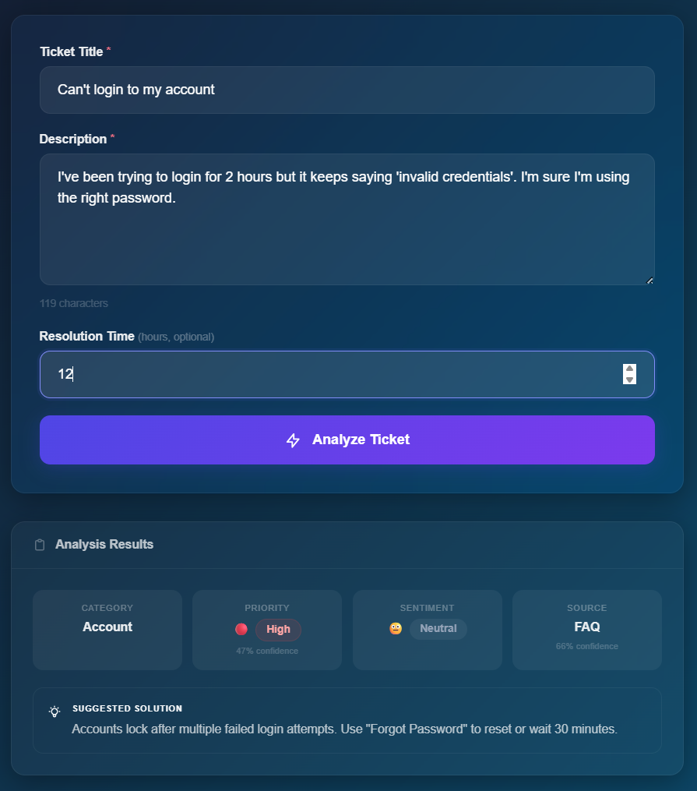
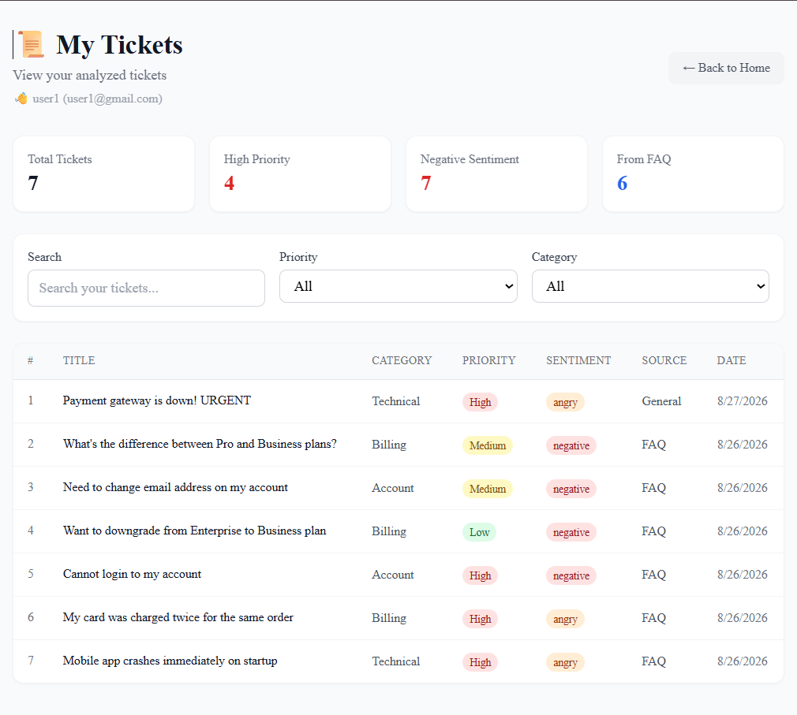
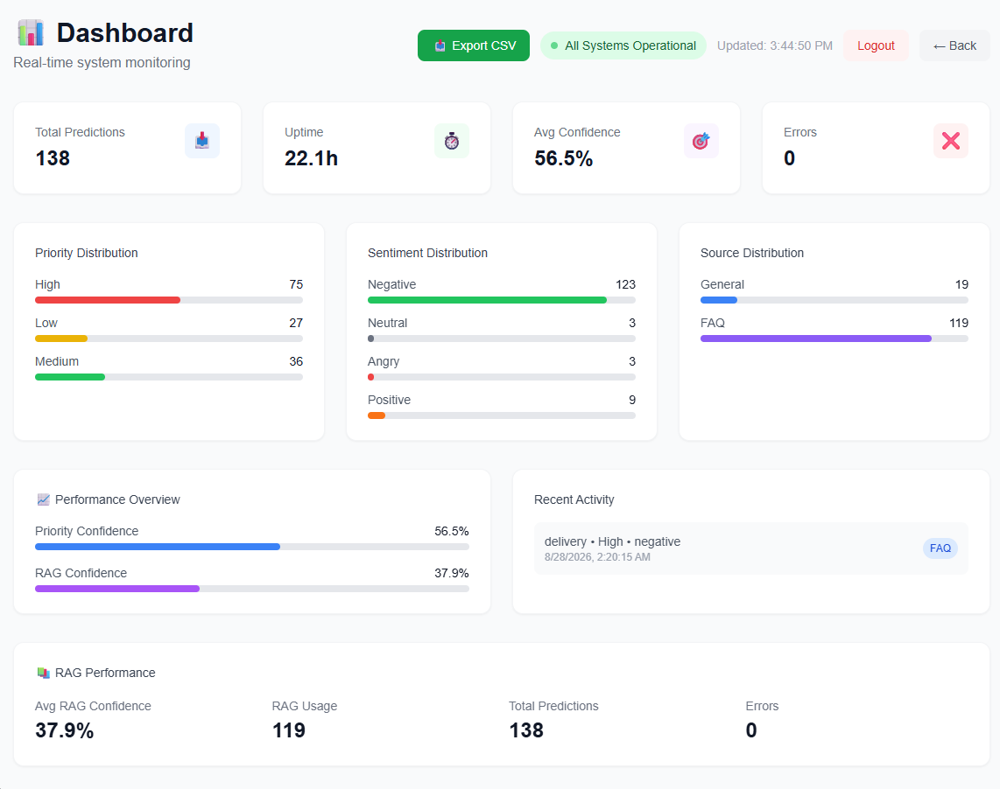
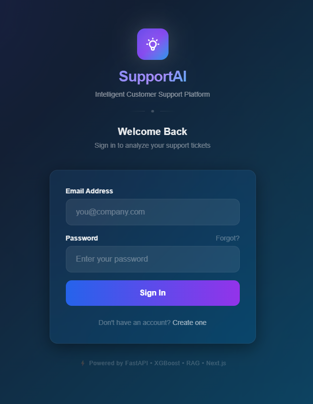

# 🤖 Customer Support AI

### Intelligent Ticket Classification & Automated Solution Retrieval

An end-to-end AI-powered customer support system that automatically analyzes customer support tickets, predicts their **category, priority, and sentiment**, and retrieves relevant solutions from a structured FAQ knowledge base using **Retrieval-Augmented Generation (RAG)**.

The system combines **Machine Learning, NLP, semantic search, FastAPI, and Next.js** into a production-oriented architecture designed for real-time ticket analysis and intelligent support assistance.

---

## 📋 Table of Contents

* [Project Overview](#-project-overview)
* [Key Features](#-key-features)
* [System Architecture](#️-system-architecture)
* [Technology Stack](#️-technology-stack)
* [Data Pipeline](#-data-pipeline)
* [Machine Learning Models](#-machine-learning-models)
* [RAG System](#-rag-system)
* [API Reference](#-api-reference)
* [Project Structure](#-project-structure)
* [Development Journey](#-development-journey)
* [Challenges & Solutions](#️-challenges--solutions)
* [Testing](#-testing)
* [Deployment](#-deployment)
* [Performance Metrics](#-performance-metrics)
* [Future Improvements](#-future-improvements)
* [Contributors](#-contributors)
* [License](#-license)
* [Contact](#-contact)

---

## 📌 Project Overview

### Business Problem

A growing digital business may receive hundreds of customer support tickets every day through different channels such as websites, mobile applications, and email.

Traditional support workflows can become inefficient because:

* Tickets are reviewed and classified manually.
* Support teams spend significant time identifying ticket urgency.
* High-priority issues may not be identified quickly.
* Finding relevant solutions from large knowledge bases is time-consuming.
* Repeated customer questions require repeated manual responses.
* There is limited visibility into ticket trends and system performance.

### 💡 Solution

**Customer Support AI** automates the initial analysis of incoming support tickets through a multi-stage AI pipeline.

For every ticket, the system can:

* 🤖 Classify the ticket into one of **4 categories**.
* 🚨 Predict ticket priority as **High, Medium, or Low**.
* 😊 Analyze customer sentiment across **4 classes**.
* 🔎 Retrieve semantically relevant FAQ entries.
* 💡 Provide a suggested solution based on the retrieved knowledge.
* 📊 Return confidence scores for predictions and retrieval.
* 🔐 Authenticate users through JWT-based authentication.
* 📈 Provide metrics and recent ticket analytics through the API.
* 🐳 Run as containerized services using Docker.

---

## ✨ Key Features

| Feature                       | Description                                                          |
| ----------------------------- | -------------------------------------------------------------------- |
| 🤖 **Ticket Classification**  | Predicts account, billing, delivery, or technical category           |
| 🚨 **Priority Prediction**    | Classifies tickets as High, Medium, or Low                           |
| 😊 **Sentiment Analysis**     | Detects Positive, Neutral, Negative, or Angry sentiment              |
| 🔎 **Semantic FAQ Retrieval** | Retrieves relevant FAQ answers using Sentence Transformers and FAISS |
| 💡 **Suggested Solutions**    | Provides relevant solutions based on retrieved FAQ knowledge         |
| 🔐 **Authentication**         | JWT-based signup and login                                           |
| 📊 **Metrics & Analytics**    | Tracks prediction metrics and recent ticket activity                 |
| 🎨 **Modern Web Interface**   | Next.js + TypeScript + Tailwind CSS frontend                         |
| 🐳 **Docker Support**         | Containerized backend and RAG services                               |
| 🔄 **Service Separation**     | Independent FastAPI and RAG services                                 |
| 🧪 **API Testing**            | Automated API validation and integration testing                     |

---

## 🏗️ System Architecture

The system follows a service-oriented architecture consisting of a **Next.js frontend**, a **FastAPI gateway**, an ML prediction pipeline, a separate RAG service, and supporting data and monitoring components.

```text
┌──────────────────────────────────────────────────────────────────────────────┐
│                              CLIENT LAYER                                    │
│                                                                              │
│                    ┌──────────────────────────────┐                          │
│                    │      Next.js Web App         │                          │
│                    │   TypeScript + Tailwind      │                          │
│                    └──────────────┬───────────────┘                          │
│                                   │                                          │
└───────────────────────────────────┼──────────────────────────────────────────┘
                                    │
                                    ▼
┌──────────────────────────────────────────────────────────────────────────────┐
│                           API LAYER — PORT 8000                              │
│                                                                              │
│                         ┌──────────────────────┐                             │
│                         │       FastAPI        │                             │
│                         │      API Gateway     │                             │
│                         └──────────┬───────────┘                             │
│                                    │                                         │
│              ┌─────────────────────┼─────────────────────┐                   │
│              │                     │                     │                   │
│              ▼                     ▼                     ▼                   │
│       ┌─────────────┐       ┌─────────────┐       ┌─────────────┐             │
│       │ Predictions │       │    Auth     │       │   Metrics   │             │
│       │   /predict  │       │  /auth/*    │       │  /metrics   │             │
│       └──────┬──────┘       └─────────────┘       └─────────────┘             │
│              │                                                               │
└──────────────┼───────────────────────────────────────────────────────────────┘
               │
               ▼
┌──────────────────────────────────────────────────────────────────────────────┐
│                            SERVICE LAYER                                     │
│                                                                              │
│  ┌──────────────────────┐   ┌──────────────────────┐   ┌──────────────────┐ │
│  │    ML Pipeline       │   │    RAG Service       │   │    Monitoring    │ │
│  │                      │   │      Port 8001       │   │     Service      │ │
│  │ • Category Model     │   │ • Sentence           │   │ • Metrics        │ │
│  │ • Priority Model     │   │   Transformers       │   │ • Error Tracking │ │
│  │ • Sentiment Model    │   │ • FAISS Index        │   │ • Analytics      │ │
│  │                      │   │ • FAQ Retrieval      │   │                  │ │
│  └──────────────────────┘   └──────────────────────┘   └──────────────────┘ │
│                                                                              │
└──────────────────────────────────────────────────────────────────────────────┘
                                    │
                                    ▼
┌──────────────────────────────────────────────────────────────────────────────┐
│                              DATA LAYER                                      │
│                                                                              │
│       ┌────────────────┐    ┌────────────────┐    ┌────────────────────┐      │
│       │ Trained Models │    │ FAQ / CSV Data │    │ Application Logs   │      │
│       │     .pkl       │    │      .csv      │    │       .log         │      │
│       └────────────────┘    └────────────────┘    └────────────────────┘      │
│                                                                              │
│                            users.json                                        │
└──────────────────────────────────────────────────────────────────────────────┘
```

### Request Flow

```text
Customer Ticket
      │
      ▼
FastAPI Gateway
      │
      ▼
ML Prediction Pipeline
      │
      ├──► Category Prediction
      │
      ├──► Priority Prediction
      │
      └──► Sentiment Prediction
      │
      ▼
RAG Service
      │
      ├──► Query Embedding
      ├──► FAISS Similarity Search
      └──► FAQ Filtering
      │
      ▼
Final Intelligent Response
```

---

## 📸 Screenshots

<table>
  <tr>
    <td align="center">
      <strong>🏠 Dashboard</strong><br>
      
    </td>
    <td align="center">
      <strong>🎫 Ticket Analysis</strong><br>
      
    </td>
  </tr>
  <tr>
    <td align="center">
      <strong>📜 User History</strong><br>
      
    </td>
    <td align="center">
      <strong>📊 Admin Metrics Dashboard</strong><br>
      
    </td>
  </tr>
  <tr>
    <td align="center" colspan="2">
      <strong>🔐 Login</strong><br>
      
    </td>
  </tr>
</table>


---

## 🛠️ Technology Stack

### Backend & AI

| Component                | Technology                  |
| ------------------------ | --------------------------- |
| **Programming Language** | Python 3.11                 |
| **API Framework**        | FastAPI 0.115.6             |
| **Machine Learning**     | scikit-learn 1.6.1          |
| **NLP**                  | NLTK 3.9.1                  |
| **Semantic Search**      | Sentence-Transformers 3.3.1 |
| **Vector Search**        | FAISS 1.9.0                 |
| **Data Processing**      | Pandas 2.2.3, NumPy 1.26.4  |
| **Validation**           | Pydantic 2.10.4             |
| **Serialization**        | Joblib 1.4.2                |
| **Authentication**       | PyJWT 2.8.0                 |

### Frontend

| Component     | Technology         |
| ------------- | ------------------ |
| **Framework** | Next.js 14.2.5     |
| **Language**  | TypeScript 5.x     |
| **Styling**   | Tailwind CSS 3.4.1 |
| **Icons**     | Lucide React       |

### Infrastructure & Development

| Component             | Technology        |
| --------------------- | ----------------- |
| **Containerization**  | Docker            |
| **Orchestration**     | Docker Compose    |
| **CI/CD**             | GitHub Actions    |
| **Security Scanning** | Bandit, Trivy     |
| **Testing**           | Pytest, API Tests |

---

# 🔄 Data Pipeline

## Data Sources

The project combines multiple datasets:

| Dataset                | Samples / Entries | Purpose                      |
| ---------------------- | ----------------: | ---------------------------- |
| **E-Commerce Data**    |            10,000 | Customer support ticket data |
| **SaaS / Tech Data**   |             9,999 | Customer support ticket data |
| **FAQ Knowledge Base** |              200+ | RAG solution retrieval       |

The combined ticket dataset contains **19,999 samples**.

---

## Data Processing Flow

```text
Raw Data
   │
   ▼
Data Cleaning
   │
   ▼
Text Preprocessing
   │
   ├── Lowercasing
   ├── Special Character Removal
   ├── Tokenization
   ├── Stopword Removal
   └── Lemmatization
   │
   ▼
Feature Engineering
   │
   ▼
TF-IDF / Engineered Features
   │
   ▼
Model Training
   │
   ▼
Model Evaluation
   │
   ▼
Saved Model Artifacts
```

## Text Preprocessing

The NLP preprocessing pipeline includes:

1. Lowercase conversion.
2. Removal of special characters and unnecessary digits.
3. Tokenization using NLTK.
4. Stopword removal.
5. Lemmatization using `WordNetLemmatizer`.

---

## Feature Extraction

### TF-IDF

TF-IDF is used to transform ticket text into numerical feature representations.

The main configuration includes:

```python
TfidfVectorizer(
    max_features=3000,
    ngram_range=(1, 2),
    stop_words="english",
    min_df=3,
    max_df=0.8
)
```

Different models use optimized TF-IDF configurations based on their respective tasks.

### Priority-Specific Features

The Priority Model additionally uses engineered features such as:

* Text length
* Word count
* Urgency keyword count
* Money keyword count
* Account keyword count
* Technical keyword count
* Punctuation count
* Capitalization count

---

# 🤖 Machine Learning Models

The system uses three supervised classification models for ticket analysis.

| Model            | Task                     | Classes                               | Performance          |
| ---------------- | ------------------------ | ------------------------------------- | -------------------- |
| 🚨 **Priority**  | Urgency prediction       | High, Medium, Low                     | **98.84% 5-Fold CV** |
| 📂 **Category**  | Issue classification     | Account, Billing, Delivery, Technical | **97.12%**           |
| 😊 **Sentiment** | Sentiment classification | Positive, Neutral, Negative, Angry    | **89.58%**           |

---

## 1. 🚨 Priority Model

### Objective

The Priority Model determines how urgently a support ticket should be handled:

* **High**
* **Medium**
* **Low**

### Dataset

The final priority dataset contains **1,290 samples**.

| Priority  |   Samples |
| --------- | --------: |
| High      |       724 |
| Medium    |       325 |
| Low       |       241 |
| **Total** | **1,290** |

### Development Approach

The priority labels were developed using a **clustering-based approach followed by manual labeling and supervised classification**.

#### Initial Attempt — KMeans + XGBoost

The first approach used:

* KMeans clustering
* 50 clusters
* Manual cluster-based priority labeling
* XGBoost classification

The resulting accuracy reached:

```text
Accuracy = 100%
```

However, this performance indicated potential overfitting.

#### Final Approach — 20 Clusters + Logistic Regression

The clustering strategy was refined by reducing the number of clusters from **50 to 20**, followed by training a Logistic Regression classifier.

Final configuration:

```python
LogisticRegression(
    C=0.5,
    max_iter=1000,
    class_weight="balanced"
)
```

### Performance

```text
5-Fold Cross-Validation Mean = 98.84%
CV Standard Deviation         = 0.88%
```

### Vectorizer

```python
TfidfVectorizer(
    max_features=3000,
    ngram_range=(1, 2),
    stop_words="english",
    min_df=3,
    max_df=0.8
)
```

---

## 2. 📂 Category Model

### Objective

The Category Model classifies support tickets into four categories:

* `account`
* `billing`
* `delivery`
* `technical`

### Configuration

```python
LogisticRegression(
    C=1.0,
    max_iter=1000
)
```

### Dataset

**19,999 ticket samples**

### Performance

```text
Accuracy = 97.12%
```

### Vectorizer

```python
TfidfVectorizer(
    max_features=10000,
    ngram_range=(1, 2),
    stop_words="english",
    min_df=2
)
```

### Category Keyword Enhancement

Domain-specific keyword lists were incorporated to strengthen category-related signals.

| Category      | Key Keywords                                                   |
| ------------- | -------------------------------------------------------------- |
| **Technical** | api, endpoint, error, crash, bug, server, gateway, integration |
| **Billing**   | payment, charge, invoice, refund, subscription, plan, upgrade  |
| **Account**   | login, password, access, verification, authentication, email   |
| **Delivery**  | shipping, order, package, tracking, arrived, missing, damaged  |

---

## 3. 😊 Sentiment Model

### Objective

The Sentiment Model identifies the emotional tone of customer tickets:

* `positive`
* `neutral`
* `negative`
* `angry`

### Dataset

The original sentiment dataset contained 1,200 samples. The dataset was subsequently enriched with additional real tickets to improve class representation.

### Final Model

```python
LogisticRegression(
    C=10.0,
    max_iter=1000,
    class_weight="balanced",
    random_state=42
)
```

### Performance

```text
Accuracy = 89.58%
```

### Vectorizer

```python
TfidfVectorizer(
    max_features=5000,
    ngram_range=(1, 2),
    stop_words="english",
    min_df=2
)
```

---

## Sentiment Model Development

### Initial Attempt — Pre-trained Models

Several pre-trained sentiment models were evaluated, including:

* DistilBERT
* Siena
* 5-star sentiment models

Their performance ranged approximately between:

```text
35% – 48% Accuracy
```

The main issue was that the pre-trained models were not sufficiently aligned with the language, patterns, and context of customer support tickets.

### Final Approach — Domain-Specific TF-IDF

A custom:

```text
TF-IDF + Logistic Regression
```

approach was developed specifically for the project's customer-support domain.

This improved performance to:

```text
89.58% Accuracy
```

### Model Improvements

The final sentiment pipeline was improved through:

1. **Keyword Enhancement**
   Added domain-specific sentiment keywords.

2. **Data Enrichment**
   Added additional real tickets to improve class representation.

3. **Class Weight Tuning**
   Used `class_weight="balanced"` to address class imbalance.

---

## Data Enrichment Strategy

The sentiment dataset was enriched to improve representation across the four classes.

| Sentiment | Original Count | After Enrichment |
| --------- | -------------: | ---------------: |
| Positive  |            200 |              484 |
| Neutral   |            300 |              400 |
| Negative  |            400 |              260 |
| Angry     |            300 |              350 |

### Data Augmentation Experiment

Synonym Replacement was also tested as a potential data augmentation strategy.

However, the experiment produced worse results than the original data because the generated samples introduced noise without addressing the underlying weaknesses of the dataset.

Therefore, the final approach focused on **real ticket enrichment rather than synthetic augmentation**.

This provided a more realistic training distribution and improved the model's ability to capture domain-specific language.

---

# 🔎 RAG System

## Overview

The RAG component provides intelligent solution retrieval by searching a structured FAQ knowledge base using semantic similarity.

Instead of relying only on keyword matching, the system converts customer queries into semantic embeddings and searches for the most relevant FAQ entries.

---

## RAG Components

| Component                | Technology                |
| ------------------------ | ------------------------- |
| **Embedding Model**      | `paraphrase-MiniLM-L3-v2` |
| **Vector Database**      | FAISS                     |
| **Index Type**           | `IndexFlatIP`             |
| **Knowledge Base**       | 200+ FAQ Entries          |
| **Retrieval**            | Top 3 Results             |
| **Similarity Threshold** | 0.25                      |

---

## FAQ Knowledge Base

The FAQ knowledge base contains **200+ entries** covering multiple customer-support domains:

* 💳 Billing & Payments
* 👤 Account Management
* 🛠️ Technical Support
* 📦 Delivery & Shipping
* ❓ General Inquiries

---

## Retrieval Flow

```text
Customer Query
      │
      ▼
Sentence Transformer
      │
      ▼
Query Embedding
      │
      ▼
FAISS Similarity Search
      │
      ▼
Top-K FAQ Results
      │
      ▼
Similarity Threshold
      │
      ▼
Relevant FAQ Answers
```

---

## RAG Microservice

The RAG system runs as an independent service on:

```text
Port 8001
```

while the main FastAPI application runs on:

```text
Port 8000
```

This separation allows the RAG component to be maintained and scaled independently from the main prediction API.

---

# 🔌 API Reference

## Base URL

```text
http://localhost:8000
```

---

## Health Check

### `GET /health`

Returns the health status of the API and verifies that the required models are loaded.

### Example Response

```json
{
  "status": "healthy",
  "service": "Customer Support AI",
  "version": "1.0.0",
  "models_loaded": true,
  "sentiment_classes": [
    "positive",
    "neutral",
    "negative",
    "angry"
  ]
}
```

---

## Predict Ticket

### `POST /api/v1/predict`

Analyzes a customer support ticket and returns:

* Category
* Priority
* Priority confidence
* Sentiment
* Suggested solution
* RAG source
* RAG confidence
* Retrieved FAQ results

### Request

```json
{
  "title": "Payment was charged twice",
  "description": "My card was charged twice for the same order",
  "resolution_time": 4
}
```

### Response

```json
{
  "category": "billing",
  "priority": "High",
  "priority_confidence": 0.612,
  "sentiment": "negative",
  "suggested_solution": "Contact support with your order number...",
  "source": "FAQ",
  "rag_confidence": 0.755,
  "rag_results": [
    {
      "question": "I was charged twice. What should I do?",
      "answer": "Contact support with your order number...",
      "category": "billing",
      "domain": "ecommerce",
      "similarity": 0.721
    }
  ]
}
```

---

## Authentication

### `POST /api/v1/auth/signup`

Creates a new user account.

### `POST /api/v1/auth/login`

Authenticates a user and returns a JWT token.

---

## Metrics

### `GET /api/v1/metrics`

Returns system-level prediction and usage metrics.

### `GET /api/v1/metrics/tickets/recent`

Returns recent ticket activity and prediction history.

### `GET /api/v1/metrics/export`

Exports prediction records as CSV.

---

## RAG Retrieval

### `POST /api/v1/rag/retrieve`

Retrieves the most relevant FAQ entries for a given query.

### Request

```json
{
  "query": "How long does a refund take?",
  "k": 2,
  "threshold": 0.4
}
```

### Response

```json
{
  "results": [
    {
      "question": "How long does a refund take?",
      "answer": "Refunds are processed within 3-5 business days...",
      "category": "billing",
      "domain": "ecommerce",
      "similarity": 0.731
    }
  ]
}
```

---

# 📁 Project Structure

```text
customer-support-ai/
│
├── .github/
│   └── workflows/
│       ├── ci.yml
│       ├── cd.yml
│       └── security.yml
│
├── backend/
│   ├── app/
│   │   ├── __init__.py
│   │   ├── main.py
│   │   │
│   │   ├── api/
│   │   │   ├── __init__.py
│   │   │   ├── routes.py
│   │   │   └── models.py
│   │   │
│   │   ├── core/
│   │   │   ├── __init__.py
│   │   │   ├── config.py
│   │   │   └── dependencies.py
│   │   │
│   │   ├── ml/
│   │   │   ├── __init__.py
│   │   │   ├── pipeline.py
│   │   │   ├── preprocessing.py
│   │   │   └── feature_extraction.py
│   │   │
│   │   ├── rag/
│   │   │   ├── __init__.py
│   │   │   ├── service.py
│   │   │   └── api.py
│   │   │
│   │   ├── monitoring/
│   │   │   └── ...
│   │   │
│   │   └── utils/
│   │       ├── __init__.py
│   │       └── logger.py
│   │
│   ├── models/
│   │   ├── priority_model_final.pkl
│   │   ├── priority_vectorizer_final.pkl
│   │   ├── priority_encoder.pkl
│   │   ├── category_model_final.pkl
│   │   ├── category_vectorizer_final.pkl
│   │   ├── category_encoder.pkl
│   │   ├── sentiment_model_final.pkl
│   │   ├── sentiment_vectorizer_final.pkl
│   │   ├── sentiment_encoder.pkl
│   │   ├── faq_index.faiss
│   │   ├── faq_index_optimized.faiss
│   │   └── faq_metadata.pkl
│   │
│   ├── data/
│   │   ├── raw/
│   │   │   ├── E-Commerce_data.csv
│   │   │   └── SaaS_Tech_data.csv
│   │   │
│   │   └── processed/
│   │       └── priority_final_data_real_low.csv
│   │
│   ├── scripts/
│   │   └── train_models.py
│   │
│   ├── tests/
│   │   └── ...
│   │
│   ├── docs/
│   │   └── BACKEND_DOCUMENTATION.md
│   │
│   ├── run.py
│   ├── run_rag.py
│   ├── test_api.py
│   ├── requirements.txt
│   ├── requirements-dev.txt
│   ├── Makefile
│   ├── Dockerfile.backend
│   ├── docker-compose.yml
│   └── .env.example
│
├── frontend/
│   ├── app/
│   │   ├── components/
│   │   ├── utils/
│   │   └── types/
│   │
│   ├── public/
│   ├── tests/
│   └── package.json
│
├── docs/
│   ├── architecture/
│   ├── backend/
│   ├── guides/
│   └── assets/
│       ├── dashboard.png
│       ├── ticket-analysis.png
│       ├── metrics-dashboard.png
│       └── login.png
│
├── scripts/
│   └── deploy.sh
│
├── .env.example
├── .gitignore
├── .pre-commit-config.yaml
├── LICENSE
├── Makefile
└── README.md
```

---

# 🧪 Development Journey

## Phase 1 — Data Preparation

The initial phase focused on preparing the datasets for machine learning and retrieval.

Steps included:

* Loading the E-Commerce dataset.
* Loading the SaaS / Tech dataset.
* Performing exploratory data analysis.
* Cleaning and preprocessing ticket text.
* Combining the datasets.
* Preparing FAQ data for semantic retrieval.

---

## Phase 2 — Priority Model Development

### Attempt 1 — 50 Clusters + XGBoost

The first priority modeling approach used:

* KMeans clustering with 50 clusters.
* Manual priority labeling.
* XGBoost classification.

Result:

```text
Accuracy = 100%
```

However, this performance was considered suspiciously high and indicated potential overfitting.

### Attempt 2 — 20 Clusters + Logistic Regression

The clustering strategy was refined by reducing the number of clusters from **50 to 20**.

The final classifier was changed to Logistic Regression.

Result:

```text
5-Fold CV Accuracy = 98.84%
CV Std = 0.88%
```

This provided a more stable and generalizable approach.

### Attempt 3 — Realistic Low-Priority Data

The original priority dataset did not contain enough realistic Low-priority examples.

To address this issue, **90 realistic Low-priority tickets** were manually created and incorporated into the dataset.

Final distribution:

```text
High   = 724
Medium = 325
Low    = 241

Total  = 1,290
```

---

## Phase 3 — Sentiment Model Development

### Attempt 1 — Pre-trained Models

Multiple pre-trained sentiment models were evaluated.

Results:

```text
35% – 48% Accuracy
```

The models were not sufficiently adapted to the project's customer-support domain.

### Attempt 2 — Domain-Specific Model

A custom TF-IDF + Logistic Regression solution was developed.

Result:

```text
Accuracy = 89.58%
```

The model was further improved through:

* Domain-specific keyword enhancement.
* Real-ticket data enrichment.
* Class-weight balancing.
* Evaluation of different feature configurations.

### Data Augmentation Experiment

Synonym replacement was tested as a data augmentation technique.

The results were worse than the original data because the generated samples introduced additional noise.

The final decision was therefore to prioritize **real ticket enrichment over synthetic augmentation**.

---

## Phase 4 — RAG System

The RAG system was implemented through the following stages:

1. Load 200+ FAQ entries.
2. Generate sentence embeddings.
3. Build a FAISS vector index.
4. Implement semantic similarity search.
5. Apply a similarity threshold.
6. Return the most relevant FAQ entries.
7. Integrate retrieval with the main prediction pipeline.

---

## Phase 5 — API Development

The backend API was built using FastAPI.

Key architectural decisions included:

* **FastAPI** for high-performance API development.
* **Pydantic** for request validation.
* Dependency injection for model management.
* Singleton-style pipeline management.
* A separate RAG service running on port `8001`.
* API-level health checks.
* Authentication and authorization endpoints.
* Metrics and prediction tracking endpoints.

---

## Phase 6 — Integration & Testing

The major system components were integrated and tested:

* [x] Priority Model
* [x] Category Model
* [x] Sentiment Model
* [x] RAG System
* [x] FastAPI API
* [x] Authentication
* [x] Metrics Endpoints
* [x] API Testing
* [x] Docker Setup
* [x] Service Integration

---

# ⚠️ Challenges & Solutions

## Challenge 1 — Lack of Low-Priority Data

### Problem

The original dataset contained insufficient Low-priority examples.

### Solution

Created 90 realistic Low-priority tickets and incorporated them into the final priority dataset.

### Impact

The model gained sufficient examples to learn the Low-priority class more effectively.

---

## Challenge 2 — Overfitting in Priority Classification

### Problem

The initial 50-cluster approach produced:

```text
100% Accuracy
```

which suggested potential overfitting.

### Solution

Reduced the number of clusters from 50 to 20 and switched the classifier to Logistic Regression.

### Result

```text
98.84% 5-Fold Cross-Validation Accuracy
```

---

## Challenge 3 — Sentiment Model Underperformance

### Problem

Pre-trained sentiment models achieved only:

```text
35% – 48% Accuracy
```

### Solution

Developed a domain-specific TF-IDF + Logistic Regression model.

### Result

```text
89.58% Accuracy
```

---

## Challenge 4 — Class Imbalance

### Problem

Some sentiment and priority classes were underrepresented.

### Solution

Used a combination of:

* Real-ticket enrichment.
* `class_weight="balanced"`.
* Manual analysis of class distributions.
* Domain-specific feature engineering.

### Result

Improved representation of minority classes and more reliable model behavior.

---

## Challenge 5 — RAG Service Integration

### Problem

The RAG component initially experienced connectivity and integration issues with the main API.

### Solution

The RAG functionality was separated into an independent service.

```text
Main API → Port 8000
RAG API  → Port 8001
```

### Result

The two services could operate independently while communicating through the API layer.

---

## Challenge 6 — NumPy Compatibility

### Problem

A dependency/version mismatch involving Python 3.11 and NumPy caused compatibility issues when loading some machine learning components.

### Solution

Dependency versions and compatibility configuration were adjusted to ensure stable model loading.

### Result

Stable model execution across the development environment.

---

## Challenge 7 — Model Artifact Management

### Problem

Model artifacts could become unavailable when Google Colab sessions were disconnected.

### Solution

A centralized export process was created to collect the trained model artifacts into a single package for transfer to the local development environment.

### Result

Simplified model transfer and reduced the risk of losing trained artifacts.

---

# 🧪 Testing

## Backend Tests

```bash
cd backend
pytest tests/ -v --cov=app
```

## Frontend Tests

```bash
cd frontend
npm run test
```

## API Tests

```bash
cd backend
python test_api.py
```

---

# 🔐 Security Exceptions

## Bandit Exceptions

The project uses **Bandit** for static security analysis. A small number of findings are intentionally excluded from the security scan because they correspond to controlled and trusted application behavior.

| Finding  | Location                           | Justification                                                                                     |
| -------- | ---------------------------------- | ------------------------------------------------------------------------------------------------- |
| **B105** | `app/api/auth.py:74`               | `'bearer'` is a token type used by the authentication scheme, not a hardcoded password.           |
| **B301** | `app/core/dependencies.py:158,167` | Required for loading trusted machine learning model artifacts (`.pkl`) from fixed internal paths. |
| **B301** | `app/rag/service.py:63`            | Required for loading trusted FAQ metadata from a fixed internal path.                             |
| **B403** | `app/core/dependencies.py:10`      | Required for loading trusted ML model files used by the application.                              |
| **B403** | `app/rag/service.py:4`             | Required for loading trusted FAQ metadata used by the RAG service.                                |

### Exception Conditions

These exceptions are considered acceptable because:

* All `.pkl` files are generated by the project's controlled training pipeline.
* Model and metadata files are loaded only from fixed internal paths such as `./models/`.
* File paths are not controlled or supplied by end users.
* The application does not dynamically download model artifacts or metadata from untrusted sources.
* The loaded artifacts are part of the application's trusted deployment package.

> **Security Note:** These exceptions are valid only under the assumptions described above. If the source, location, or loading mechanism of these files changes, the corresponding Bandit exceptions must be reviewed and reassessed.


---

# 🐳 Deployment

## Docker Deployment

### Build Images

```bash
docker-compose build
```

### Start Services

```bash
docker-compose up -d
```

### Check Logs

```bash
docker-compose logs -f
```

### Stop Services

```bash
docker-compose down
```

---

## Manual Development Setup

### 1. Create Virtual Environment

#### Windows

```bash
python -m venv .venv
.venv\Scripts\activate
```

#### Linux / macOS

```bash
python -m venv .venv
source .venv/bin/activate
```

### 2. Install Dependencies

```bash
pip install -r requirements.txt
```

### 3. Train Models

```bash
python scripts/train_models.py
```

### 4. Start RAG Service

```bash
python run_rag.py
```

### 5. Start Main API

Open another terminal:

```bash
python run.py
```

### 6. Start Frontend

```bash
cd ../frontend
npm install
npm run dev
```

---

# 🌐 Access Points

| Service               | URL                          |
| --------------------- | ---------------------------- |
| **Frontend**          | `http://localhost:3000`      |
| **Main API**          | `http://localhost:8000`      |
| **RAG Service**       | `http://localhost:8001`      |
| **API Documentation** | `http://localhost:8000/docs` |

---

# 📊 Performance Metrics

| Model         | Performance | Configuration                                |
| ------------- | ----------: | -------------------------------------------- |
| **Priority**  |  **98.84%** | 5-Fold CV, 20 Clusters + Logistic Regression |
| **Category**  |  **97.12%** | Logistic Regression                          |
| **Sentiment** |  **89.58%** | Logistic Regression, 4 Classes               |

### Model Summary

```text
Priority Model
──────────────
5-Fold CV Accuracy : 98.84%
CV Std              : 0.88%

Category Model
──────────────
Accuracy            : 97.12%

Sentiment Model
──────────────
Accuracy            : 89.58%
```

> **Note:** The Priority Model performance is reported as 5-Fold Cross-Validation accuracy, while Category and Sentiment performance are reported as their respective evaluation accuracy. These metrics should not be interpreted as directly equivalent evaluation protocols.

---

# 🔮 Future Improvements

Potential future improvements include:

1. **Data Expansion** — Increase the size and diversity of the training datasets.
2. **Sentiment Improvement** — Fine-tune transformer-based models on customer-support data.
3. **FAQ Expansion** — Increase the size and coverage of the knowledge base.
4. **Active Learning** — Use agent feedback to continuously improve model predictions.
5. **RAG Evaluation** — Introduce systematic retrieval-quality evaluation.
6. **Model Monitoring** — Track model performance and data drift over time.
7. **A/B Testing** — Compare different model versions in production.
8. **Feedback Collection** — Allow support agents to provide feedback on predictions and retrieved solutions.
9. **Advanced Authentication** — Integrate more robust production-grade identity management.
10. **Scalable Infrastructure** — Introduce production-ready service orchestration and distributed deployment.

---

# 👩‍💻 Contributors

## Eng. Aya Mohamed

**Project Lead | Machine Learning Engineer | AI Developer**

End-to-end project development was handled by **Eng. Aya Mohamed**, including:

* Machine Learning model development
* NLP preprocessing and feature engineering
* Priority classification
* Category classification
* Sentiment analysis
* Data enrichment and experimentation
* RAG implementation
* Semantic search with Sentence Transformers and FAISS
* FastAPI API development
* Authentication and metrics integration
* Frontend/backend integration
* Testing and debugging
* Dockerization and deployment setup
* System architecture and technical documentation

---

# 📄 License

This project is licensed under the **MIT License**.

See the [`LICENSE`](LICENSE) file for details.

---

# 📬 Contact

* **GitHub:** [Aya-Mohamed945](https://github.com/Aya-Mohamed945)
* **LinkedIn:** [Eng. Aya Mohamed](https://www.linkedin.com/in/aya-abd-elazim-94a256347/)
* **Email:** [aya.320240137@ejust.edu.eg](mailto:aya.320240137@ejust.edu.eg)

---

<div align="center">

### ⭐ Customer Support AI

**End-to-End AI-Powered Customer Support**

Built with Machine Learning, NLP, RAG, FastAPI, and Next.js.

### Built with ❤️ by Eng. Aya Mohamed

</div>
